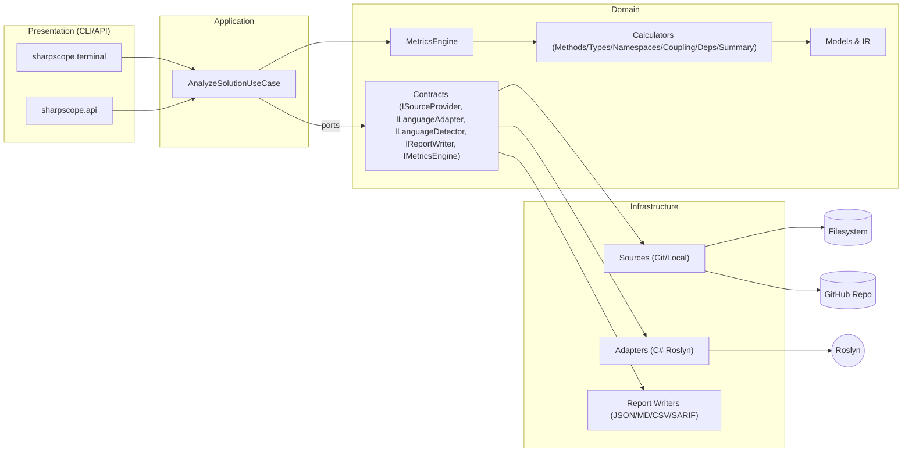

# 🩺 Sharpscope
_- The stethoscope of C# -_

> **Sharpscope** analyzes codebases via **CLI** and **API** (Docker-ready) and computes **44 software quality metrics** across method/type/namespace levels, including coupling and dependency cycles.  
> Input: **local directory** or **public GitHub repo URL**.  
> Output: **JSON / Markdown / CSV / SARIF**.

---

## ✨ Overview

- **Goal:** fast, reliable insight into code health with classic metrics (SLOC, CYCLO, WMC, LCOM3…), coupling (CA/CE/I/A/D), FAN-IN/OUT and dependency cycles.
- **Architecture:** Clean/Hexagonal — _Domain_ defines the **language-agnostic IR**, calculators and contracts; _Infrastructure_ implements adapters (Roslyn/Git/FS); _Application_ orchestrates use cases; _Presentation_ exposes CLI/API.
- **No database:** results are computed on demand and written to files.

---

## 🧭 Architecture Diagram


---

## 🧪 Analysis Flow


---

## 📏 Metrics (44) — Legend & Full Names

> See [docs/METRICS.md]()
 for complete definitions, formulas, and examples.

**Summary (15)**
- TotalNamespaces — total namespaces
- TotalTypes — total types
- MeanTypesPerNamespace — mean types per namespace
- TotalSloc — total Source Lines of Code (SLOC)
- AvgSlocPerType, MedianSlocPerType, StdDevSlocPerType — stats of SLO C per type
- TotalMethods — total methods
- AvgMethodsPerType, MedianMethodsPerType, StdDevMethodsPerType — stats of methods per type
- TotalComplexity — total Cyclomatic Complexity (sum of method CYCLO, i.e., WMC total)
- AvgComplexityPerType, MedianComplexityPerType, StdDevComplexityPerType — stats of complexity per type

**Namespaces (2)**
- NOC — Number of Classes/Types
- NAC — Number of Abstract Classes

**Types (10)**
- SLOC — Source Lines of Code (per type)
- NOM — Number of Methods
- NPM — Number of Public Methods
- WMC — Weighted Methods per Class (sum of method cyclomatic complexities)
- DEP — Dependencies (distinct referenced types, internal+external)
- I-DEP — Internal Dependencies (distinct internal referenced types)
- FAN-IN — Number of other types that depend on this type
- FAN-OUT — Number of other types referenced by this type
- NOA — Number of Attributes/Fields
- LCOM3 — Lack of Cohesion in Methods (LCOM3)

**Methods (5)**
- MLOC — Method Lines of Code
- CYCLO — Cyclomatic Complexity (1 + decision points)
- CALLS — Number of Invocations
- NBD — Nested Block Depth
- PARAM — Number of Parameters

**Namespace Coupling (5)**
- CA — Afferent Coupling (#incoming deps from other namespaces)
- CE — Efferent Coupling (#outgoing deps to other namespaces)
- I — Instability = CE / (CA + CE)
- A — Abstractness = (#abstract types + interfaces) / (#types)
- D — Normalized Distance from Main Sequence = |A + I − 1|

**Type Coupling (4)**
- DEP — Dependencies
- I-DEP — Internal Dependencies
- FAN-IN — In-degree (types depending on this one)
- FAN-OUT — Out-degree (types referenced by this one)

**Dependencies (3)**
- DEP — Total Distinct Dependencies (solution-level)
- I-DEP — Total Distinct Internal Dependencies (solution-level)
- Cycles — Dependency Cycles (SCCs > 1) per Type and Namespace

---

## 🧱 Estrutura do repositório

```
├─ Application/Sharpscope.Application
│  ├─ DTOs/         ├─ Mapping/      ├─ Services/     └─ UseCases/
├─ Domain/Sharpscope.Domain
│  ├─ Models/       ├─ Contracts/    ├─ Calculators/  └─ Exceptions/
├─ Infrastructure
│  ├─ Sharpscope.Adapters.Csharp/Roslyn/
│  └─ Sharpscope.Infrastructure/
│     ├─ Sources/   ├─ Detection/    └─ Reports/
├─ Presentation
│  ├─ Sharpscope.Api/    (Minimal API)
│  └─ Sharpscope.Terminal (CLI)
└─ Tests/Sharpscope.Test
   ├─ DomainTests/  ├─ AdapterCSharpTests/  ├─ InfrastructureTests/
   ├─ IntegrationTests/   └─ Snapshots/reports/
```

---

## 🧰 Use Cases

* **CLI** (`sharpscope.terminal`)

  * `analyze --path <dir>` → analyze a local solution
  * `analyze --repo <url>` → clone a public repo and analyze
  * opções: `--format json|md|csv|sarif`, `--exclude`, `--include-tests`, `--fail-on "WMC>50;CYCLO>15;D>0.7"`

* **API** (`sharpscope.api`)

  * `POST /analyze` `{ "path": "...", "repo": "...", "options": {...} }` → enqueue in-memory job
  * `GET /reports/{id}` → return the produced report
  * **Docker**: multi-stage build (sdk → runtime)

* **Reports**

  * **JSON** (complete, machine-friendly)
  * **Markdown** (human-friendly summary + tables)
  * **CSV** (by entity)
  * **SARIF** (optional for CI pipelines)

---

## 🧩 Design notes

- **Clean/Hexagonal:** Domain defines contracts; Infrastructure provides adapters (Roslyn/Git/FS).
- **No DB:** ephemeral state; clean temp dirs after runs.
- **Performance:** controlled parallelism; ignore bin/, obj/, generated files.
- **Language-agnostic core:** reading/parsing lives in language adapters; calculators are generic.
- **Metric computation choices:**

  * **CYCLO**: `1 + decision points`
  * **WMC**: `Σ(CYCLO of methods)`
  * **LCOM3**: `1 - (Σ μ(a) / (m*n))`, bounded to [0,1]; `if m ≤ 1 or n ≤ 1 ⇒ 0.0`
  * **I** = `CE / (CA + CE)`, A = abstractness ratio, D = `|A + I − 1|`

---

## 🧪 Testing

- **Unit tests (Domain):** all calculators + `MetricsEngine`  
- **Snapshots:** stable JSON reports  
- **Integration:** small fixtures, end-to-end  
- **Property-based (optional):** invariants (e.g., `WMC ≥ max(CYCLO)` of the type)  

---

## 🚀 Getting started

- 🔧 **Work in progress** — installation guide, CLI/API examples, Dockerfiles and scripts are being prepared.

---

## 📦 Roadmap

- [ ] CLI: polished commands/flags + rich help  
- [ ] API: job cancellation & size limits  
- [ ] C# Adapter: stronger heuristics for generated/partial code  
- [ ] SARIF export with configurable severities  
- [ ] Multi-language support (new `ILanguageAdapter`)  
- [ ] Perf: incremental cache & Roslyn warm-up  
- [ ] Docs: extension guide (build your own adapter)  

---

## 🤝 Contributing

1. Fork ✨  
2. Create a branch: `feat/my-feature`  
3. Ensure **tests pass** and **lint is clean**  
4. Submit a PR with context (before/after, decisions)  

---

## 📄 License

MIT — see LICENSE.

---

## 📬 Contact

Questions, ideas, bugs?  
Open an Issue or a PR.  
Let’s build **Sharpscope** together! 💬
